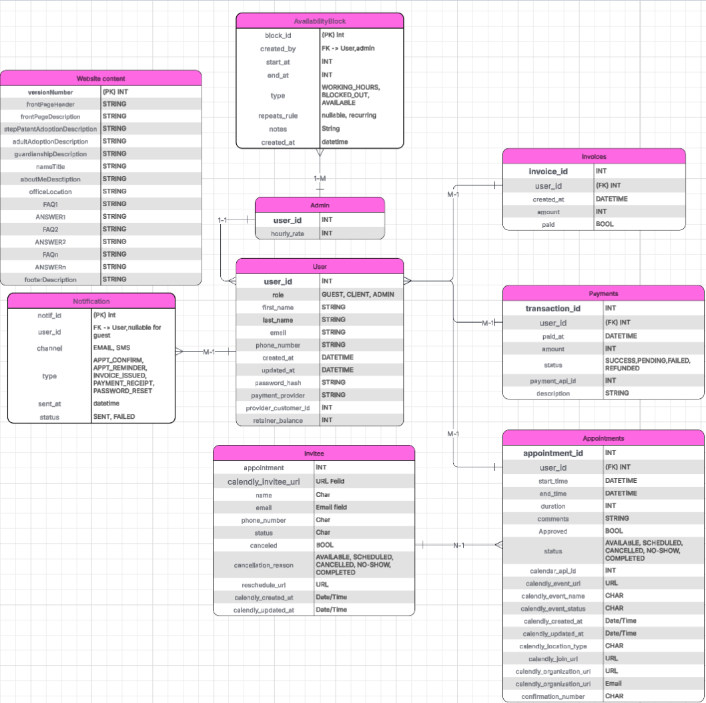
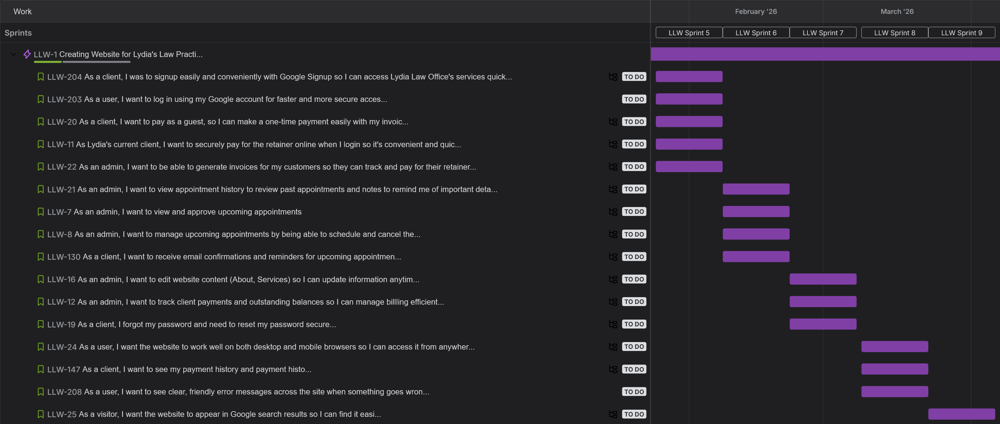

```
                 __          ____  _          _ _   ____            _       _   
      .,-;-;-,. /'_\        / ___|| |__   ___| | | / ___|  ___ _ __(_)_ __ | |_ 
    _/_/_/_|_\_\) /         \___ \| '_ \ / _ \ | | \___ \ / __| '__| | '_ \| __|
  '-<_><_><_><_>=/\          ___) | | | |  __/ | |  ___) | (__| |  | | |_) | |_ 
    `/_/====/_/-'\_\        |____/|_| |_|\___|_|_| |____/ \___|_|  |_| .__/ \__|
     ""     ""    ""                                                 |_|        

```

# Lydias-Law-Site

## 🧭 Project Overview

Lydia’s Law Site is a full-stack web application built for adoption attorney Lydia A. Suprun to modernize her practice and make her services more accessible to clients. Designed and developed by Shell Script, a senior project team from California State University, Sacramento, the site enables clients to schedule appointments, make secure payments, and learn more about Lydia’s work.

The project bridges real-world business needs with modern web development practices using Django, MySQL, and Bootstrap to deliver a reliable, responsive, and user-friendly experience. Built with future maintainability in mind, the platform allows Lydia to easily manage her content and continue growing her practice well beyond the completion of this project.

## Getting Started 🚀

### 🛠️ Prerequisites 
- Python 3.8 or higher installed
- A configured database (or access credentials ready)
- Google, Calendly, and Stripe API keys prepared for your .env file

## ⚙️ Configuration

### 1. Create and activate virtual environment

#### MacOS / Linux
```
$ python3 -m venv venv/
$ source venv/bin/activate
```
#### Microsoft
```
PS> py -m venv .venv\
PS> .venv\Scripts\activate
```

### 2. Install necessary python packages (virtual environment should be activated before)
```
$ pip install -r requirements.txt
```
### 3. Setting Up .env File 🔐
#### MacOS / Linux
```
cp .env.example .env
```
#### Windows
```
copy .env.example .env
```
#### Configure the .env File
###### Open the newly created .env file and fill in all the required environment variables (e.g., DATABASE_URL, SECRET_KEY, email settings, API keys, etc)
###### ⚠️The application will not run properly without valid environment variables⚠️ 

### 4. Running the Django Server ▶️
#### Start the development Server once environment variables and dependencies are configured
```
python manage.py runserver
```

## Features

### 1. Overview
Lydia's Law Site gives clients information about Lydia A. Suprun and her practice areas as an adoption lawyer. Clients can schedule appointments with her and make payments through the site. Aditionally, admin has control of what information the site contains and is able to manage appointments and payments.

### 2. Appointment Scheduling
- Clients can schedule appointments through the Contact Page or through their dashboard once they log in 
- Admin can schedule appointments for clients through their dashboard once they log in
- Clients will automatically recieve an email confirmation and reminder with appointment information

### 3. Payment
- Clients without an account are able to make payments through the payment page after recieving an invoice number
- Clients with an account can automatically see how much they owe and make payments after they log in

### 4. Client Dashboard
Through their dashboards, clients can:
- Schedule, cancel, and view upcoming appointments
- Make payments and view past transactions

### 5. Admin Dashboard
Through their dashboard, admin can:
- Schedule, cancel, and view upcoming and past appointments
- View complete and uncomplete transaction
- View client list
- Make edits to the content of the site

## 🧱 Architecture Overview

<p align="center">
  
</p>

### Project Application (`Lydias_Law_Site`)
- Stores the main project configuration, including:
  - Global Django settings
  - Root URL routing
  - WSGI/ASGI setup

### Core Application (`core`)
- Contains most of the website’s foundational functionality, including:
  - All primary HTML templates
  - Main URL paths
  - Core view logic used across the site

### Additional Applications

#### 📅 Appointments (`appointments`)
- Handles all Calendly-related operations, including sending and receiving API data.
- Includes database models for:
  - Appointments
  - Invitees
  - Notifications

#### 💰 Finances (`finances`)
- Contains models for payments and invoices.
- Will integrate with Stripe for financial transactions and tracking.

#### 📝 Site Content (`sitecontent`)
- Powers the Home, About, and Contact pages.
- Contains models for storing dynamic site content.

#### 👤 Users (`users`)
- Manages all authentication and account processes, including:
  - Login and signup
  - Email verification
  - Secure user session handling
- Includes models for:
  - User profiles
  - Admin profiles

## 🧑‍💻 Tech Stack Overview
### Frontend:
- Mark-up/Styling: HTML/CSS
- Framework: [Bootstrap](https://getbootstrap.com/)
### Backend:
- Programming Language: [Python](https://www.python.org/)
- Framework: [Django](https://www.djangoproject.com/)
- Database: [MySQL](https://www.mysql.com/)

## Roadmap for Success🏆
<p align="center">
  
</p>


## 🔒 Security and Privacy
- Beacuse the site handles user accounts, appoinments, and payments, it includes basic security measures to protect client data:
  - Passwords are hashed and never soted in plain text
  - Payment processing is handled through a secure thrid party provider, so no credit card information is stored on the site
  - Input validation and access controls help prevent unauthorized access

## Deployment (next semester)
 ... 
## Testing (next semester)
 ...
## Developer Instructions (next semester)
 ...

## Contributors 🐢
- [Hunter Powell](https://github.com/hunterpowell)
- [Michael Kenny](https://github.com/mlkenny)
- [Jason Prakash](https://github.com/jasoonkp)
- [Moises Robledo](https://github.com/moises9973)
- [Maria Adil](https://github.com/MADIL99)
- [Regina Gil](https://github.com/reggiee76)
- [Alex Giovannini](https://github.com/ARGiovannini)
- [Nayeli Flores Valdez](https://github.com/nayelifv)
